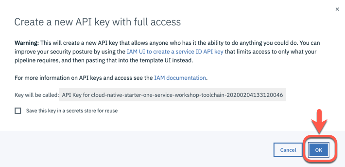

# Toolchain for 'Cloud Native Starter Workshop - One Service'

# Table of Content

1. [Register for IBM Cloud](#part-SETUP-00)
2. [Insert feature code](#part-SETUP-01)
3. [Create a free Kubernetes cluster](#part-SETUP-02)
4. [Configure the IBM Cloud Container Registry](#part-SETUP-03)
5. [Build a IBM Cloud toolchain](#part-SETUP-04)
6. [Work with the created toolchain](#part-SETUP-05)

# 1. Register for IBM Cloud 

#### Step 1: Open a browser window and navigate to the IBM Cloud [Registration page](https://ibm.biz/Bd2JHx).

#### Step 2: Fill in the registration form and follow the link in the **confirmation email** to confirm your account once it arrives.

#### Step 3: [Login into IBM Cloud](https://ibm.biz/Bd2JHx) using your account credentials.

_Note:_ By default, all new IBM Cloud accounts are set to a [lite version](https://www.ibm.com/cloud/pricing).

The lite account provides free access to a subset of IBM Cloud resources. Lite accounts **don't need a credit-card** to sign up and they **don't expire** after a certain period of time. 
In order to create a free Kubernetes cluster, you need a **feature code**.

---

# 2 Insert feature code 

In order to execute the workshop easily, we provide **feature codes** to create free Kubernetes clusters, so no credit card details are required.
To apply the feature code to your [Cloud Account](https://cloud.ibm.com/account), navigate to your "`Account settings`" and then to ("`Manage`" -> "`Account`").
Enter your unique Feature (Promo) Code to upgrade your lite account.

_Note:_ Free clusters expire after one month.

---

# 3 Create a free Kubernetes Cluster 

#### Step 1: Logon to IBM Cloud

#### Step 2: Select in the menu "Catalog" and search for "Kubernetes Cluster"

#### Step 3: Click on "Kubernetes Cluster"

#### Step 4: Press "Create"

#### Step 5: Click on the Kubernetes Services and select "Free"

Ensure you set following values in the creation dialog and don't change the remaining values:

* Cluster name:     cloud-native

_Note:_ In the new IBM Cloud UI it seems the enties for Geography and Metro are no longer available.

#### Step 6: Press "Create custer"

#### Step 7: Now you will be forwarded to your cluster on IBM Cloud and you can verify the status of the creation of your cluster

The creation of the custer takes up to 20 min.

# 4 Configure the IBM Cloud Container Registry 

#### Step 1: Select in **Kubernetes** the entry **Registry** and ensure your are in the **Dallas location**.

#### Step 2: The create a namespace with a unique name cloud-native-[YOURNAME]

_Note:_ Namespaces are required to be **unique** across the entire **region** that the **specific registry** is located in, not just ***unique to your account**. This is mentioned in the following [public documentation](https://cloud.ibm.com/docs/services/Registry?topic=registry-getting-started#gs_registry_namespace_add).

#### Step 3: Verify the namespace was created

# 5 Build a IBM Cloud toolchain 

#### Step 1: Press "Create toolchain"

#### Step 2: Select the us-south region

TBD

#### Step 3: Configure the location for the cloned github project

I our situation we use **git repos and issue tracking hosted by IBM and built on GitLab Community Edition**.

We will clone the _Cloud Native Starter_ project to a repository called **cloud-native-starter-one-service-workshop**-TIMESTAMP.  

_Note:_ Depending on your region selection you maybe have to authorize the GitLab hosted in that IBM region.

#### Step 4: Create a IBM Cloud API key by pressing "new" and "ok"

Enable the toolchain to create services or set configurations in your IBM Cloud Account, for that it needs an "IBM Cloud API key" depending the region you are working in.

_Note:_ You will be informed which name is used.

#### Step 5: Verify the configuration

You see your the relevant information of your created IBM Cloud Container Registry and the IBM Cloud Cluster.
Do not change the defaults!

_Note:_ Especially don't change the Kubernetes namespace name, because you need to know image pull secret credentials to access a container registry. 
For more details visit the following pages.

* [Documentation on IBM Cloud](https://cloud.ibm.com/docs/containers?topic=containers-images)
* [Documentation on Kubernetes](https://kubernetes.io/docs/concepts/containers/images/)

#### Step 6: Press "Create"

# 6 Work with the created toolchain 

# 7 Information resources about developing a open toolchain

* [Creating Custom Toolchain Templates](https://github.com/open-toolchain/sdk/wiki/Creating-Custom-Toolchain-Templates)
* [Configuring tool integrations](https://cloud.ibm.com/docs/services/ContinuousDelivery?topic=ContinuousDelivery-integrations)