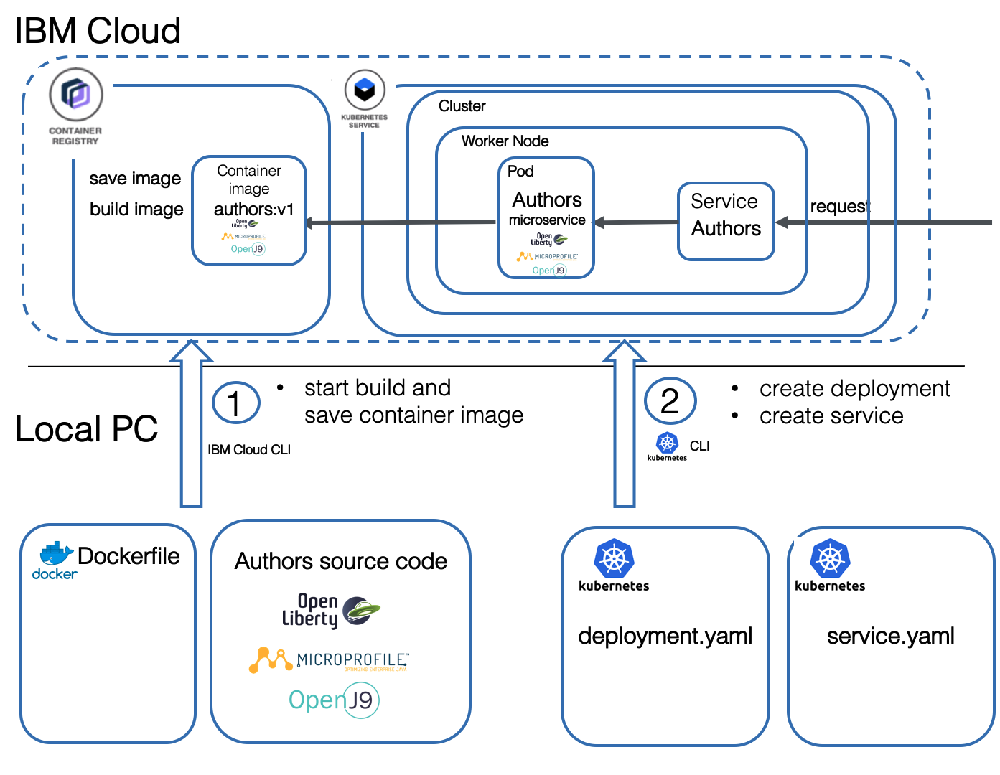

## Workshop: Use a IBM Cloud toolchain to deploy a Java Microservices to Kubernetes on IBM Cloud

This hands-on workshop is related to the Cloud-Native-Starter hands-on workshop [Build a Java Microservice and deploy the Microservice to Kubernetes on IBM Cloud](https://github.com/IBM/cloud-native-starter/tree/master/workshop-one-service)

In this workshop you automate the deployment the steps of [Lab 4 - Deploy to Kubernetes](https://github.com/IBM/cloud-native-starter/blob/master/workshop-one-service/4-kubernetes.md) in the hands-on workshop.
The Authors Microservice of the will be automated deployed to a free Kubernetes cluster on IBM Cloud.

### Estimated time and level

|  Time | Level  |
| - | - |
| one hour | beginners |

### Objectives

After you complete this workshop, you'll understand the toolchain automation to deploy the authors microservice.

* Build the container for the authors microservice
* Save the container in the IBM Cloud Registry
* Deploy the authors microservice to the free Kubernetes cluster on IBM Cloud

In the following image you get an overview deployment of the authors microserviceto to a free IBM Cloud Kubernetes Cluster.

### About this workshop

The introductory page of the workshop is broken down into the following sections:

* [Agenda](#agenda)
* [Compatibility](#compatibility)
* [Technology Used](#technology-used)
* [Credits](#credits)

### Agenda

These are the labs of this workshop, go through all of them in sequence, start with lab 1:

|   |   |
| - | - |
| [Lab 1](lab1/README.md) | Register for IBM Cloud |
| [Lab 2](lab2/README.md) | Insert feature code |
| [Lab 3](lab3/README.md) | Create a free Kubernetes cluster |
| [Lab 4](lab4/README.md) | Configure the IBM Cloud Container Registry |
| [Lab 5](lab5/README.md) | Deploy the Microservice with the  IBM Cloud toolchain |
| [Lab 6](lab6/README.md) | Use the created toolchain |
| [Lab 7](lab7/README.md) | Verify the deployed authors microservice |

### Compatibility

This workshop has been tested on the following platforms:

* [**IBM Cloud Kubernetes service**](https://www.ibm.com/cloud/container-service/): Kubernetes version 1.17.5_1522 (Plan:free) 
* [**IBM Cloud Continuous Delivery**](https://www.ibm.com/cloud/continuous-delivery): (Plan: Lite)

### Technology Used

* [Jakarta EE](https://jakarta.ee/)
* [MicroProfile](https://microprofile.io/)
* [Microservices architecture](https://en.wikipedia.org/wiki/Microservices)
* [Docker](https://www.docker.com/)
* [Open Toolchain](https://github.com/open-toolchain)
* [Kubernetes](https://kubernetes.io/)
* [Open Liberty](https://openliberty.io/)
* [GitLab](https://about.gitlab.com/)

### Credits

* [Thomas Südbröcker](https://twitter.com/tsuedbroecker)
* [Niklas Heidloff](https://twitter.com/nheidloff)
* [Harald Uebele](https://twitter.com/Harald_U)

