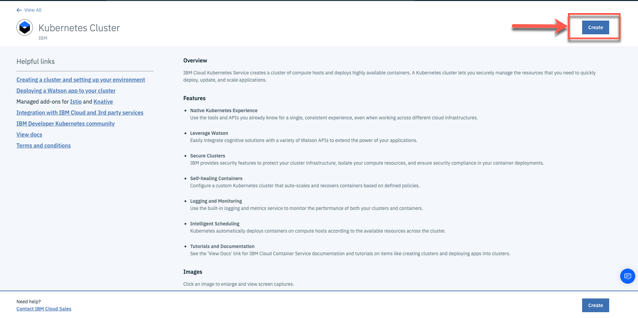

# Lab 3: Create a free Kubernetes Cluster

---

#### Step 1: Logon to IBM Cloud

---

#### Step 2: Select in the menu "Catalog" and search for "Kubernetes Cluster"

---

#### Step 3: Click on "Kubernetes Cluster"

---

#### Step 4: Press "Create"

---

#### Step 5: Click on the Kubernetes Services and select "Free"

Ensure you set following values in the creation dialog and don't change the remaining values:

* Cluster name:     cloud-native

_Note:_ In the new IBM Cloud UI it seems the enties for Geography and Metro are no longer available.

#### Step 6: Press "Create custer"

---

#### Step 7: Now you will be forwarded to your cluster on IBM Cloud and you can verify the status of the creation of your cluster

The creation of the custer takes up to 20 min.
> _Note:_ If you in a hands-on session please inform your instructor that you have finished step 7.

