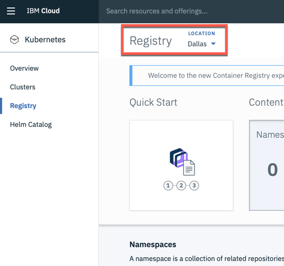
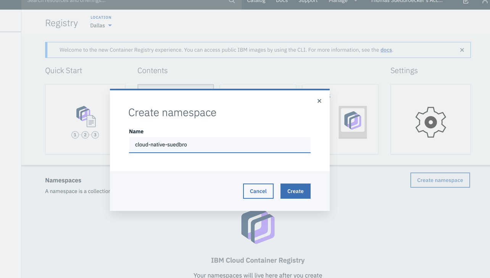
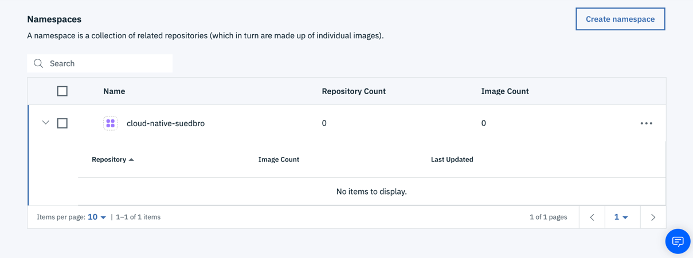

### Lab 4: Configure the IBM Cloud Container Registry

---

### Step 1: Select in **Kubernetes** the entry **Registry** and ensure your are in the **Dallas location**.

---

### Step 2: The create a namespace with a unique name cloud-native-\[YOURNAME\]

_Note:_ Namespaces are required to be **unique** across the entire **region** that the **specific registry** is located in, not just **unique to your account**. This is mentioned in the following [public documentation](https://cloud.ibm.com/docs/services/Registry?topic=registry-getting-started#gs_registry_namespace_add).

---

#### Step 3: Verify the namespace was created

