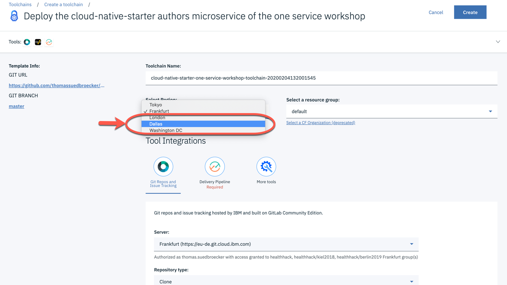
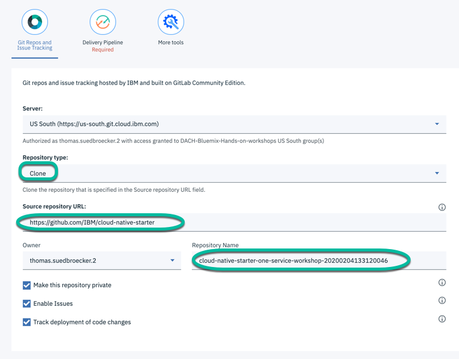
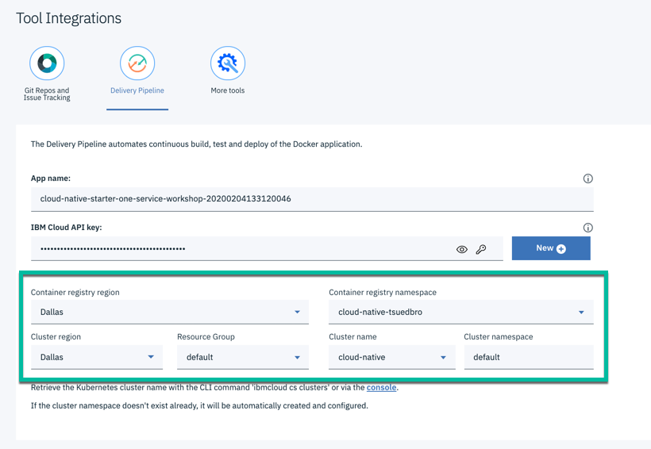
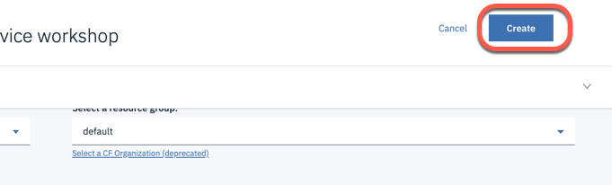

# Lab 5: Deploy the Microservice with the IBM Cloud toolchain

---

#### Step 1: Press "Create toolchain"

---

#### Step 2: Select the Dallas as region

> _Note:_ If you already have an [Continous Delivery](https://cloud.ibm.com/docs/ContinuousDelivery?topic=ContinuousDelivery-getting-started) service instance using a [Lite plan](https://cloud.ibm.com/docs/services/Db2onCloud?topic=Db2onCloud-free_plan) in your IBM Could Account, you must choose the region for your Toolchain where you instantiated your service. _The image below shows the warning._

---

#### Step 3: Configure the location for the cloned GitHub project

I our situation we use **git repos and issue tracking hosted by IBM and built on GitLab Community Edition**.

We will clone the _Cloud Native Starter_ project to a repository called **cloud-native-starter-one-service-workshop**-TIMESTAMP.

_Note:_ Depending on your region selection you maybe have to authorize the GitLab hosted in that IBM region.

#### Step 4: Create a IBM Cloud API key by pressing "new" and "ok"

Enable the toolchain to create services or set configurations in your IBM Cloud Account, for that it needs an "IBM Cloud API key" depending the region you are working in.

_Note:_ You will be informed which name is already in use.

* Create a IBM Cloud API key

* Notification dialog

#### Step 5: Verify the configuration

You see your the relevant information of your created IBM Cloud Container Registry and the IBM Cloud Cluster. Do not change the defaults!

_Note:_ If you change the Kubernetes namespace name, you need to be aware of the image pull secret credentials to access a container registry. For more details please visit the following pages.

* [Documentation on IBM Cloud](https://cloud.ibm.com/docs/containers?topic=containers-images)
* [Documentation on Kubernetes](https://kubernetes.io/docs/concepts/containers/images/)

---

#### Step 6: Press "Create"

--- 
