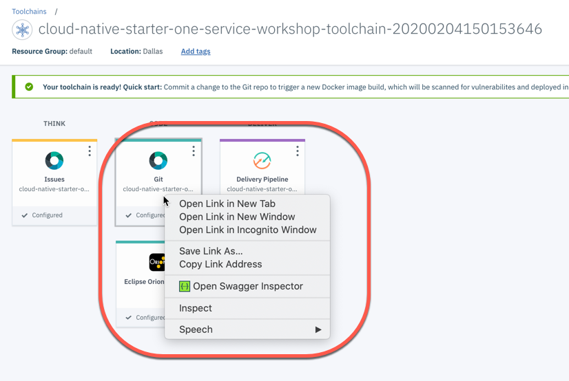
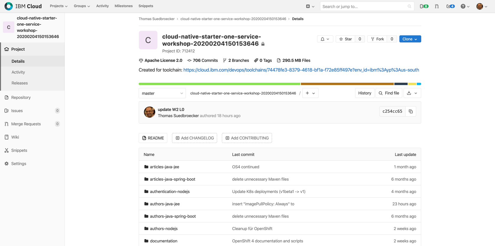
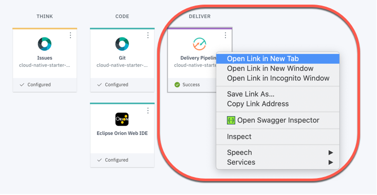
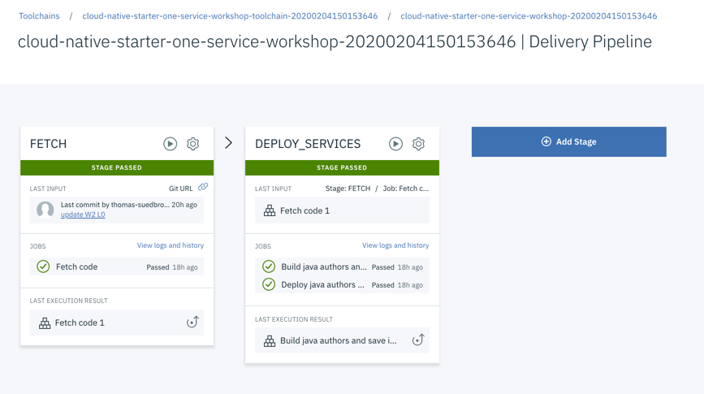

# Lab 6 - Work with the created toolchain 

In the toolchain you see:

* **Think** Issues managed in GitLab
* **Code**  [Eclipse Orion Web IDE](https://cloud.ibm.com/docs/services/ContinuousDelivery?topic=ContinuousDelivery-web_ide) and source code managed in GitLab
* **Delivery** Managed in the in the [Continues Delivery service](https://cloud.ibm.com/catalog/services/continuous-delivery#about)

---

### Step 1: Visit the create GitLab project inside IBM Cloud

Open the GitLab repository in a new browser tab.

---

### Step 2: Take a look in the cloned Cloud Native Starter project

---

### Step 3: Go back to the toolchain and visit the delivey pipeline

---

### Step 4: In the delivery pipeline you see two stages

Wait until the stages and their jobs are executed.

* FETCH _Does copy the source code in the Fetch code job, to the pipeline to provide the source code as an input for the DEPLOY SERVICES Stage_
* DEPLOY SERVICES _Does a build and deploy job to deploy the authors microservice to the Kubernetes cluster on IBM Cloud._

