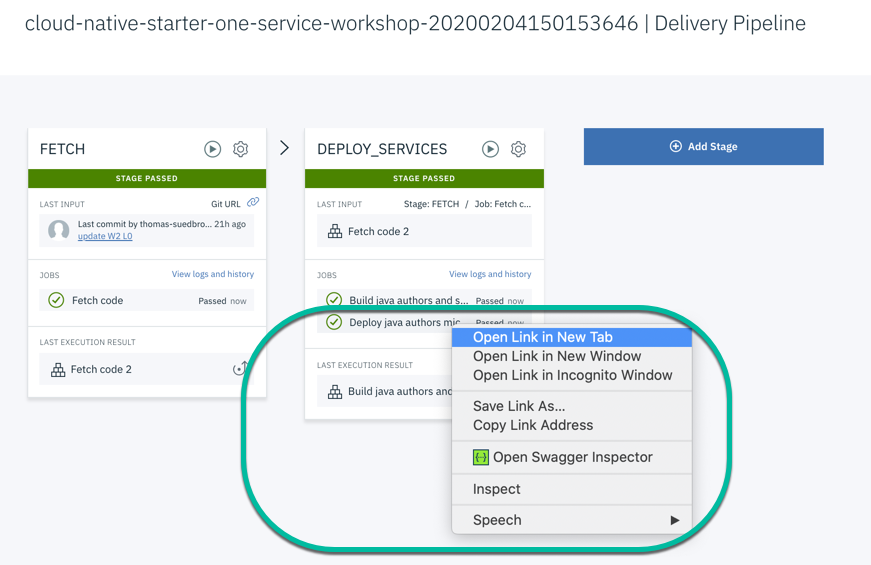
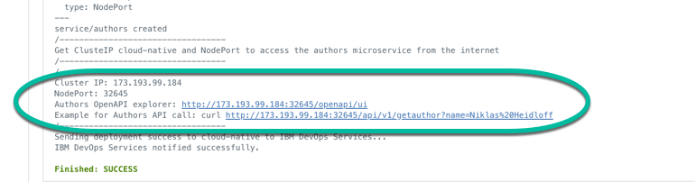

# Lab 7: Verify the deployed authors Microservice

---

### Step 1: Open the deployment job in a new browser tab

Open the **deploy java authors microservice to the Kubernetes cluster** job, in the **DEPLOY SERVICES** stage of the pipeline.



---

### Step 2: Verify the deployment job logs and open the OpenAPI explorer of the authors microservice to test the microservice

You see following steps in the following gif.

1. Find the URL of the authors OpenAPI explorer in the logs 
2. Copy the OpenAPI explorer URL in to a browser or just open the URL in a new tab of the current browser

   

3. Press "Try it out"
4. Press "Execute"
5. Verify the "Reponse body"

   ```javascript
   {
    "name": "Niklas Heidloff",
    "twitter": "https://twitter.com/nheidloff",
    "blog": "http://heidloff.net"
    }
   ```


**Congratulations** you have finished the workshop.